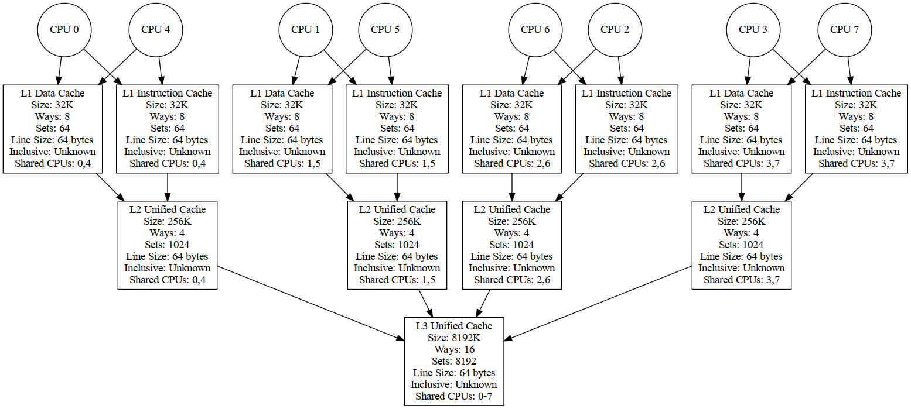

# x86 Cache Hierarchy Plot

This repository contains a Python script to visualize the cache hierarchy of x86 CPUs. The script generates a graphical representation of the CPU cache hierarchy using Graphviz, showing the relationship between CPU cores and their associated cache levels (L1, L2, L3). It illustrates how caches are shared across cores and details their properties such as size and associativity.

## Features

- **Automatic Detection**: The script automatically detects all CPUs and their respective caches on an x86 system by reading data from the `/sys/devices/system/cpu` directory.
- **Cache Details**: Extracts detailed information about each cache, including level (L1, L2, L3), size, type (instruction, data, unified), ways of associativity, number of sets, coherency line size, and inclusivity.
- **Shared CPU Information**: Identifies which CPUs share a particular cache and visually represents this in the generated graph.
- **Graphviz Visualization**: Creates a visual representation of the cache hierarchy using Graphviz, showing connections between CPU cores and caches.
- **ASCII Visualization**: Creates an ASCII-art visualization of the CPU cores and caches.

## Requirements

- Python 3.x
- Graphviz installed and available in the system's PATH and the corresponding Python package (either `pip3 install graphviz` or `sudo apt install python3-graphviz`)
- Access to the `/sys/devices/system/cpu` directory (typically requires running the script on a Linux system)
- (Optional) GraphEasy (`sudo apt install libgraph-easy-perl`) for ASCII output

## Usage

1. **Run the Script:**
   Execute the script by running:
   ```sh
   python3 plot.py
   ```

2. **Output:**
   - The script will output a `.png` file named `cpu_cache_hierarchy_all_cpus.png` in the current directory. This image visualizes the cache hierarchy of all detected CPUs.
   Additionally, it also outputs the `.dot` file `cpu_cache_hierarchy_all_cpus`.

   - The generated graph shows CPUs as circular nodes and caches as rectangular nodes. Arrows show the connection between CPUs and their respective caches, with labels detailing cache properties.



3. **(Optional) ASCII Output:**
    - If a terminal output is required, the tool can be started with `--short`:
    
    ```sh
    python3 plot.py --short
    ```
    
    The resulting dot file can be rendered using the `graph-easy` tool (`sudo apt install libgraph-easy-perl`):
    
    ```sh
    graph-easy cpu_cache_hierarchy_all_cpus --boxart
    ```
    
    - A sample ASCII output of the same CPU as above looks as follows:

```
                                    ┌───────────────┐     ┌─────────────────┐     ┌─────────────────┐     ┌──────────────────┐
                                    │     CPU 0     │     │     L1D 32K     │     │     L2 256K     │     │                  │
                                    │               │ ──▶ │  8-way 64 sets  │ ──▶ │ 4-way 1024 sets │ ──▶ │                  │
                                    └───────────────┘     └─────────────────┘     └─────────────────┘     │                  │
                                      │                     ▲                       ▲                     │     L3 8192K     │
                                      └────────────────┐    │                       │                     │ 16-way 8192 sets │ ◀─────┐
                                                       │    │                       │                     │                  │       │
              ┌───────────────┐     ┌───────────────┐  │  ┌─────────────────┐     ┌─────────────────┐     │                  │       │
              │    L1I 32K    │     │     CPU 7     │  │  │      CPU 4      │     │     L1I 32K     │     │                  │       │
  ┌─────────▶ │ 8-way 64 sets │ ◀── │               │  │  │                 │ ──▶ │  8-way 64 sets  │     │                  │ ◀┐    │
  │           └───────────────┘     └───────────────┘  │  └─────────────────┘     └─────────────────┘     └──────────────────┘  │    │
  │             │                     │                │                            ▲                       ▲                   │    │
  │             │                     │                └────────────────────────────┘                       │                   │    │
  │             │                     ▼                                                                     │                   │    │
┌───────┐       │                   ┌───────────────┐     ┌─────────────────┐                               │                   │    │
│ CPU 3 │       │                   │    L1D 32K    │     │     L2 256K     │                               │                   │    │
│       │ ──────┼─────────────────▶ │ 8-way 64 sets │ ──▶ │ 4-way 1024 sets │ ──────────────────────────────┘                   │    │
└───────┘       │                   └───────────────┘     └─────────────────┘                                                   │    │
                │                                           ▲                                                                   │    │
                └───────────────────────────────────────────┘                                                                   │    │
                                                                                                                                │    │
                                    ┌───────────────┐     ┌─────────────────┐     ┌─────────────────┐                           │    │
                                    │     CPU 1     │     │     L1D 32K     │     │     L2 256K     │                           │    │
                                    │               │ ──▶ │  8-way 64 sets  │ ──▶ │ 4-way 1024 sets │ ──────────────────────────┘    │
                                    └───────────────┘     └─────────────────┘     └─────────────────┘                                │
                                      │                     ▲                       ▲                                                │
                                      └────────────────┐    │                       │                                                │
                                                       │    │                       │                                                │
                                    ┌───────────────┐  │  ┌─────────────────┐     ┌─────────────────┐                                │
                                    │     CPU 2     │  │  │      CPU 5      │     │     L1I 32K     │                                │
                                 ┌─ │               │  │  │                 │ ──▶ │  8-way 64 sets  │                                │
                                 │  └───────────────┘  │  └─────────────────┘     └─────────────────┘                                │
                                 │    │                │                            ▲                                                │
                                 │    │                └────────────────────────────┘                                                │
                                 │    ▼                                                                                              │
                                 │  ┌───────────────┐     ┌─────────────────┐                                                        │
                                 │  │    L1D 32K    │     │     L2 256K     │                                                        │
                                 │  │ 8-way 64 sets │ ──▶ │ 4-way 1024 sets │ ───────────────────────────────────────────────────────┘
                                 │  └───────────────┘     └─────────────────┘
                                 │    ▲                     ▲
                                 │    │                     │
                                 │    │                     │
                                 │  ┌───────────────┐     ┌─────────────────┐
                                 │  │     CPU 6     │     │     L1I 32K     │
                                 │  │               │ ──▶ │  8-way 64 sets  │
                                 │  └───────────────┘     └─────────────────┘
                                 │                          ▲
                                 └──────────────────────────┘
```
